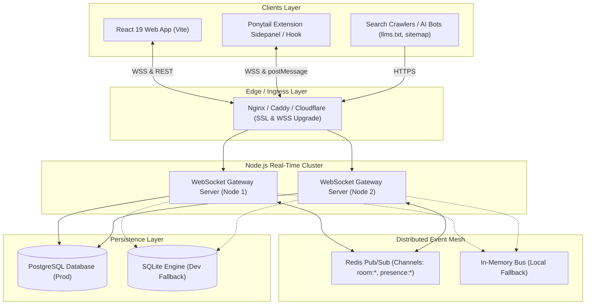
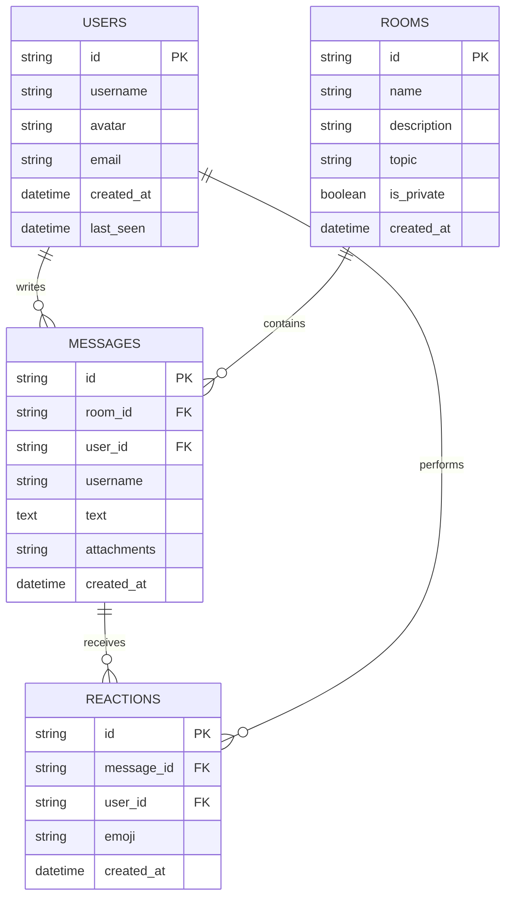

# System Architecture Document

## Project: PulseChat — Distributed Real-Time Messaging Platform
**Version**: 2026.1  
**Architecture Style**: Event-Driven Distributed Micro-Engine / WebSocket Gateway with Redis Pub/Sub Mesh & Dual Persistence (PostgreSQL / SQLite).

---

## 1. High-Level Architecture Diagram



---

## 2. WebSocket Protocol Definition

PulseChat operates on a structured, strongly-typed JSON WebSocket protocol. All frames follow this envelope:

```json
{
  "type": "MESSAGE_TYPE",
  "payload": {},
  "timestamp": "2026-09-19T06:30:00.000Z",
  "requestId": "uuidv4-string"
}
```

### 2.1 Client-to-Server Messages

| Event Type | Payload Fields | Description |
|---|---|---|
| `AUTH` | `{ userId, username, avatar }` | Registers user session and initializes connection. |
| `JOIN_ROOM` | `{ roomId }` | Subscribes client socket to a room channel. |
| `LEAVE_ROOM` | `{ roomId }` | Unsubscribes client socket from a room channel. |
| `SEND_MESSAGE` | `{ roomId, text, attachments? }` | Broadcasts new message to room; saves to DB. |
| `TYPING_START` | `{ roomId }` | Emits typing telemetry to active room peers. |
| `TYPING_STOP` | `{ roomId }` | Emits typing cessation to active room peers. |
| `ADD_REACTION` | `{ messageId, roomId, emoji }` | Toggles or increments emoji reaction on a message. |
| `HEARTBEAT` | `{}` | Keeps connection alive and refreshes online presence. |

### 2.2 Server-to-Client Messages

| Event Type | Payload Fields | Description |
|---|---|---|
| `AUTH_SUCCESS` | `{ user, activeRooms }` | Acknowledges authentication and returns initial state. |
| `ROOM_HISTORY` | `{ roomId, messages, onlineUsers }` | Hydrates past chat history upon room entry. |
| `NEW_MESSAGE` | `{ id, roomId, sender, text, timestamp, reactions }` | Pushes incoming message to all room subscribers. |
| `USER_TYPING` | `{ roomId, username, isTyping }` | Relays typing indicator to room members. |
| `PRESENCE_UPDATE` | `{ roomId, onlineUsers: [{ userId, username }] }` | Broadcasts refreshed list of active participants. |
| `REACTION_UPDATED` | `{ messageId, reactions: { "🔥": 3, "❤️": 2 } }` | Synchronizes updated reaction counts. |
| `ERROR` | `{ code, message }` | Dispatches validation or transport errors. |

---

## 3. Redis Pub/Sub Mesh Topology

To achieve seamless horizontal scalability across multiple server instances:
1. When a client sends `SEND_MESSAGE`, Server Instance A writes the record to PostgreSQL.
2. Server Instance A publishes the message event to Redis channel `pulsechat:room:<roomId>`.
3. All Server Instances (A, B, C...) subscribed to `pulsechat:room:<roomId>` receive the event via Redis.
4. Each instance dispatches the message frame to its locally connected WebSocket clients in that room.

**Zero-Configuration Fallback:** If Redis is unavailable on the host, the `PubSubAdapter` transparently routes events through an internal Node.js `EventEmitter` event bus, allowing 100% full feature parity in single-instance/dev environments.

---

## 4. PostgreSQL & SQLite Schema



---

## 5. Security & Rate-Limiting Architecture
1. **Origin Verification**: WebSocket handshake validates `Origin` against allowed CORS list.
2. **Input Validation**: All payloads validated strictly with Zod schemas before database insertion or broadcasting.
3. **Sliding-Window Rate Limiter**: Maximum 30 messages/minute per IP/User to prevent spamming.
4. **HTML Sanitization**: Message content sanitized before broadcast to prevent stored XSS attacks.
5. **No Source Map Leaks**: Production frontend builds disable `.map` file generation.
